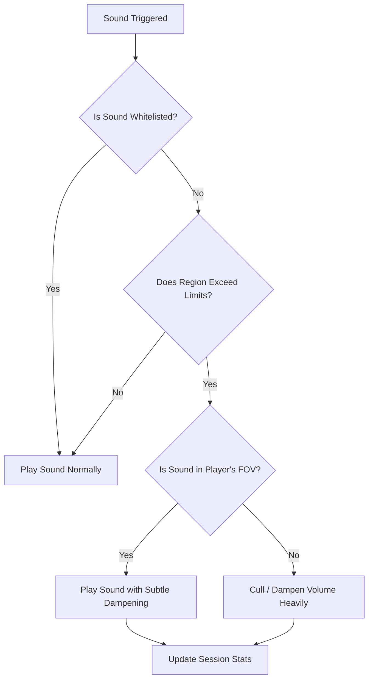

# 🎧 Sound Culling

[](https://minecraft.net)
[](#installation)
[](LICENSE)

Sound Culling is a lightweight Minecraft mod that limits and dampens excessive overlapping sounds in farms, machinery-heavy areas, and crowded multiplayer environments. It prioritizes useful nearby sounds while reducing audio clutter, with configurable limits for different sound categories.

---

## ✨ Key Features

- **Dynamic Volume Dampening:** Reduces excessive overlapping sounds instead of abruptly muting everything.
- **Directional Prioritization:** Prioritizes sounds in front of the player and applies stronger culling to less relevant sounds behind them.
- **Per-Category Limits:** Configure separate limits for hostile mobs, neutral mobs, blocks, machinery, ambient sounds, and other categories.
- **In-Game Configuration:** Adjust settings through the built-in configuration screen.
- **Low Overhead:** Uses lightweight sound-engine hooks and avoids expensive world scanning.

---

## 🎨 Beautiful In-Game GUI

Configuring your sound limits has never been easier. The integrated config panel features side-by-side grids, real-time value adjustments, responsive tooltip guides, and live session stats showing exactly how many sounds have been culled.

```
+-------------------------------------------------------------+
|                         SOUND CULLING                       |
|                    Configuration Panel                      |
+------------------------------+------------------------------+
|     SYSTEM CONFIGURATION     |    SOUND CATEGORY LIMITS     |
|                              |                              |
|  Region Total      [ 6 ] +   |  Hostile Mobs     [ 3 ] +    |
|  Time Window       [ 20t] +  |  Neutral Mobs     [ 2 ] +    |
|  Region Size       [ 16b] +  |  Blocks/Spawners  [ 5 ] +    |
|  Debug Logs      [DISABLED]  |  Ambient Sounds   [ 4 ] +    |
|                              |  Default Limit    [ 3 ] +    |
+------------------------------+------------------------------+
|                     Session Culled: 342 sounds              |
|        [ Save & Close ]      [ Cancel ]      [ Reset ]      |
+-------------------------------------------------------------+
```

---

## 📐 Culling Logic Overview



---

## 📥 Installation

Choose your preferred modloader and install the mod jar into your `.minecraft/mods` folder.

### 🧵 Fabric
1. Make sure you have the [Fabric Loader](https://fabricmc.net/) installed.
2. Place the jar file and the **Fabric API** in your `mods` folder.
3. *(Optional)* Install **Mod Menu** to access the in-game configuration panel.

### 🔨 Forge
1. Download the correct [Minecraft Forge](https://files.minecraftforge.net/) installer.
2. Put the jar file into your `mods` folder.
3. The custom configuration panel is fully integrated with Forge's Mod List (click "Config" next to our mod).

### ⚡ NeoForge
1. Download the modern [NeoForge](https://neoforged.net/) installer.
2. Place the jar file in your `mods` folder.
3. Access the custom config screen directly from the NeoForge Mods menu.

---

## 🛠️ Configuration Details

Configuration values are stored inside `config/soundculling.json`. You can edit them via the in-game GUI or directly edit the file.

| Parameter | Default | Description |
|---|---|---|
| `maxTotalPerRegion` | `6` | Maximum total combined sounds of any type allowed inside a single region. |
| `windowTicks` | `20` | Evaluation time window in game ticks (20 ticks = 1 second). |
| `regionSize` | `16.0` | Region boundary size in blocks (16.0 = 1 chunk). |
| `limitHostile` | `3` | Independent sound limit for Hostile mob sounds. |
| `limitNeutral` | `2` | Independent sound limit for Neutral mob sounds (perfect for animal farms!). |
| `limitBlock` | `5` | Sound limit for blocks, machinery, and spawners. |
| `limitAmbient` | `4` | Sound limit for ambient environment sound cues. |
| `limitDefault` | `3` | Default fallback limit for other sound categories. |
| `debugLogging` | `false` | Enables an aggregated culling summary in the console every 100 ticks. |

---

## 🚀 Game Commands

You can also control settings and inspect culling statistics dynamically using in-game chat commands:

* `/soundculling` — Displays current mod limits, region settings, and total culled sound statistics for the session.
* `/soundculling limit <n>` — Dynamically adjusts the default category limit.
* `/soundculling total <n>` — Dynamically adjusts the combined regional limit.

---

## 🏗️ Building from Source

To compile the projects yourself, clone the repository and run gradle:

```bash
# Clone the repository
git clone https://github.com/Cukkoo12/SoundCulling.git
cd SoundCulling

# Build Fabric (root project)
gradlew build

# Build Forge port
cd forge
gradlew build

# Build NeoForge port
cd ../neoforge
gradlew build
```

The compiled mod files will be located in each subproject's `build/libs/` directory.

---

## 📄 License

This project is licensed under the MIT License - see the [LICENSE](LICENSE) file for details.
