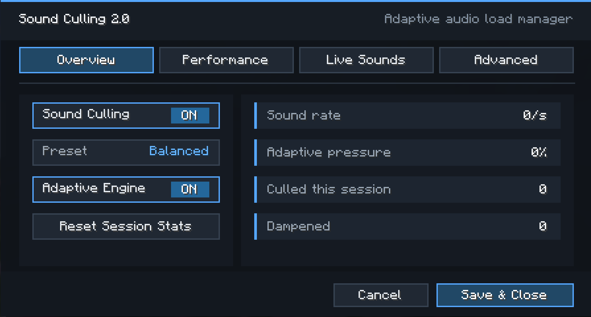
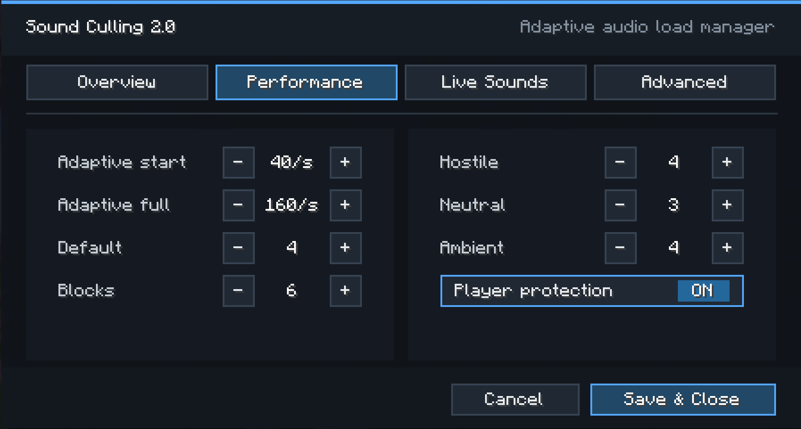
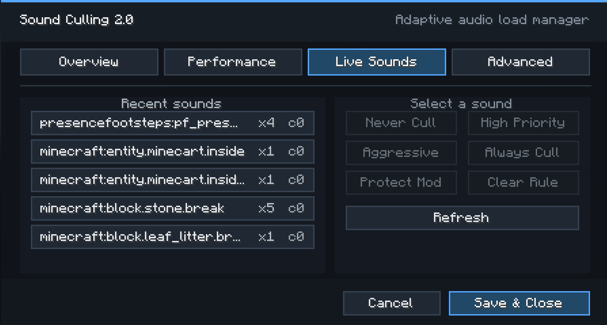
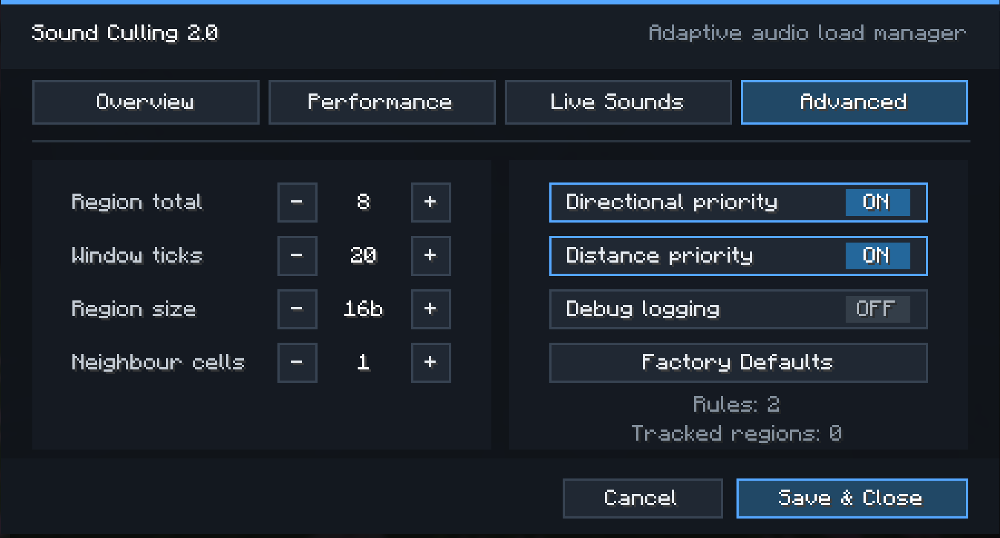

# 🎧 Sound Culling

[](https://modrinth.com/mod/sound-culling)
[](https://www.curseforge.com/minecraft/mc-mods/sound-culling)
[](LICENSE)

**Sound Culling** is a lightweight client-side Minecraft mod that reduces unnecessary audio work and sound clutter in noisy areas.

Instead of simply muting sounds after too many are playing, **Sound Culling 2.0** uses a priority-based audio engine that considers distance, direction, category, repetition, spatial density, source fairness, player relevance, and current audio pressure.

The result is a quieter, cleaner soundscape without making important gameplay sounds disappear.

> **Sound Culling 2.0.0 is currently released for Fabric on Minecraft 26.1.2.**
> Older folders in this repository contain previous ports and versions and may not include every 2.0 feature.

---

## ✨ What's New in Sound Culling 2.0

- **Priority-Based Culling Engine**
  Sounds are evaluated by relevance instead of relying only on simple category limits.

- **Adaptive Audio Pressure**
  The mod automatically becomes more aggressive when the game is flooded with sound events.

- **True Pre-Start Culling**
  Unnecessary sounds can be rejected before an audio channel is started.

- **Spatial Sound Tracking**
  Sounds are grouped into nearby regions with neighbouring-cell awareness.

- **Per-Source Fairness**
  A single piston clock, machine, farm, or repeated source cannot consume the entire sound budget.

- **Persistent & Looping Sound Management**
  Looping and tickable sounds are handled separately with smooth dampening and recovery.

- **Player Sound Protection**
  Important feedback such as attacks, hurt sounds, eating, drinking, and burping is protected from overly aggressive culling.

- **Live Sounds Inspector**
  See recently triggered sounds, trigger counts, and culled counts in real time.

- **Per-Sound Rules**
  Mark sounds as Never Cull, Critical, High Priority, Normal, Aggressive, or Always Cull.

- **Protect Mod**
  Protect an entire mod namespace directly from the Live Sounds page.

- **Wildcard Rules**
  Rules can target exact sounds, sound groups, or complete namespaces such as `presencefootsteps:*`.

- **Three Presets**
  Balanced, Performance, and Aggressive, plus automatic Custom mode.

- **Completely Redesigned UI**
  Overview, Performance, Live Sounds, and Advanced pages with live statistics.

- **Fail-Open Safety**
  If Sound Culling encounters an unexpected compatibility error while evaluating a sound, vanilla playback is allowed instead of crashing the client.

- **Safer Configuration Loading**
  Invalid or corrupted config files fall back safely.

- **1.x Configuration Migration**
  Existing configuration values are migrated to the 2.0 format where possible.

---

## 🖥️ Configuration UI

### Overview

Quick access to the master toggle, presets, adaptive engine, and live session statistics.



### Performance

Tune adaptive thresholds and category limits.



### Live Sounds

Inspect recently triggered sound IDs and create rules without manually editing configuration files.



### Advanced

Fine-tune region tracking, spatial behaviour, priorities, and diagnostic settings.



---

## ⚙️ Presets

| Preset | Behaviour |
| --- | --- |
| **Balanced** | Recommended default. Reduces excessive repetition while preserving a natural soundscape. |
| **Performance** | More aggressive limits for busy farms, machinery, and modpacks. |
| **Aggressive** | Maximum reduction under heavy audio load. |
| **Custom** | Automatically selected when individual settings are changed manually. |

---

## 🎯 Sound Rules

Rules can be created directly from the **Live Sounds** page.

| Rule | Effect |
| --- | --- |
| **Never Cull** | Always protects the selected sound from Sound Culling. |
| **Critical** | Gives the sound extremely high priority. |
| **High Priority** | Strongly favours the sound during heavy audio load. |
| **Normal** | Uses normal engine priority. |
| **Aggressive** | Makes the selected sound easier to dampen or cull. |
| **Always Cull** | Prevents the selected sound from starting. |
| **Protect Mod** | Creates a namespace-wide Never Cull rule for the selected mod. |
| **Clear Rule** | Removes the exact rule, or the active namespace rule when applicable. |

Wildcard patterns are supported, for example:

```text
minecraft:block.piston.*
bettercombat:*
presencefootsteps:*
```

---

## 🧠 How It Works

When a sound is triggered, Sound Culling evaluates several factors before deciding what should happen:

```text
Sound Triggered
      │
      ▼
Rule / Compatibility Checks
      │
      ▼
Distance + Direction + Category
      │
      ▼
Spatial Density + Repetition
      │
      ▼
Per-Source Fairness
      │
      ▼
Adaptive Audio Pressure
      │
      ├── Important / Relevant ──► Play Normally
      │
      ├── Medium Priority ───────► Dampen Smoothly
      │
      └── Low Priority ─────────► Cull Before Start
```

This allows a noisy machine or farm to be reduced without randomly deleting unrelated nearby sounds.

---

## 🔊 Persistent & Looping Sounds

Persistent sounds are treated differently from repeated one-shot sounds.

Sound Culling can smoothly reduce persistent audio while the surrounding audio load is high, then restore it when pressure drops. This helps avoid harsh cuts in sounds such as moving minecarts and other continuously updated audio sources.

---

## 🛡️ Compatibility

Sound Culling 2.0 includes compatibility-focused behaviour for complex audio environments.

Tested scenarios include:

- **Better Combat**
- **Sound Physics Perfected**
- **Presence Footsteps**
- Vanilla player attack / hurt feedback
- Eating, drinking, and burping sounds
- Persistent minecart audio
- Heavy repeated machinery sounds
- Multiple unrelated sounds under high audio pressure

The engine is also designed to **fail open**: if evaluation unexpectedly fails, the sound is allowed to play instead of crashing the client.

---

## 📊 Live Statistics

The Overview and Advanced pages expose live information such as:

- Sound events per second
- Adaptive pressure
- Culled sounds this session
- Dampened sounds
- Tracked spatial regions
- Recent sound trigger counts
- Recent sound cull counts

Because the configuration screen does not pause the single-player world, these statistics can update while you inspect them.

---

## 📥 Installation

### Fabric — Minecraft 26.1.2

1. Install the correct **Fabric Loader** for Minecraft 26.1.2.
2. Install the compatible **Fabric API**.
3. Place `soundculling-2.0.0.jar` in your `mods` folder.
4. Launch the game.

**Optional:** Install **Mod Menu** to access the configuration screen from the Mods menu.

> Make sure all installed mods match your Minecraft version. Mixing 26.1.x and 26.2 mod builds can cause binary compatibility errors.

---

## 🛠️ Configuration

The configuration file is stored in:

```text
config/soundculling.json
```

Most users should configure the mod through the in-game UI.

Advanced users can edit the JSON manually. Sound Culling 2.0 includes safe loading and migration logic so invalid or older configuration files do not unnecessarily prevent the client from starting.

---

## 🌍 Localization

Sound Culling 2.0's configuration interface uses Minecraft translation keys.

Language files are located under:

```text
src/main/resources/assets/soundculling/lang/
```

Community translations can be added without changing the UI code.

---

## 🧪 Stability & Testing

Sound Culling 2.0 has been tested with:

- Heavy repeated sound stress
- Adaptive pressure at high event rates
- Per-source fairness
- Real hard culling
- Persistent sound recovery
- Corrupted configuration fallback
- Fail-open error handling
- Namespace rules
- Preset switching
- Live Sounds inspection
- Multi-mod audio compatibility

The release build is produced from a clean source tree with diagnostic test hooks removed and debug logging disabled by default.

---

## 🏗️ Building from Source

Clone the repository:

```bash
git clone https://github.com/Cukkoo12/SoundCulling.git
cd SoundCulling/fabric-2612
```

Build the Fabric 26.1.2 project:

### Windows

```powershell
.\gradlew.bat clean build
```

### Linux / macOS

```bash
./gradlew clean build
```

The release JAR will be created under:

```text
fabric-2612/build/libs/
```

---

## 📦 Other Minecraft Versions

This repository contains multiple version and loader folders from previous Sound Culling releases.

Their feature sets may differ from Sound Culling 2.0. Check the appropriate Modrinth or CurseForge file page before downloading for another Minecraft version.

---

## 📥 Downloads

Sound Culling is officially available on:

- 🟢 **Modrinth:** https://modrinth.com/mod/sound-culling
- 🟠 **CurseForge:** https://www.curseforge.com/minecraft/mc-mods/sound-culling

---

## 🐛 Bug Reports

If you encounter a problem, open a GitHub issue and include:

- Minecraft version
- Mod loader and loader version
- Sound Culling version
- Relevant installed audio/combat mods
- `latest.log`
- Crash report, if one exists
- Steps to reproduce the problem

Please avoid reporting a random crash as fixed or reproducible unless the crash can actually be reproduced from the provided information.

---

## 📄 License

Sound Culling is licensed under the **MIT License**.

See [LICENSE](LICENSE) for details.
